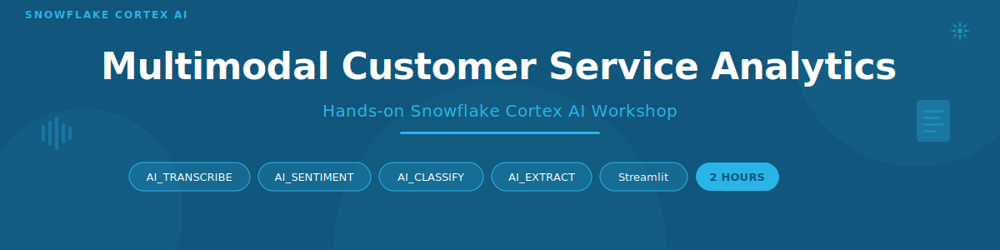

<p align="center">
  
</p>

A 2-hour hands-on workshop where you build an end-to-end AI-powered customer service analytics system entirely within Snowflake — processing audio, text, and PDF data using pure SQL.

> **Based on**: [Extracting Insights from Multimodal Customer Data](https://quickstarts.snowflake.com/guide/extracting-insights-from-multimodal-customer-data/) Snowflake Quickstart — extended with a Streamlit Dashboard module

## What You Will Build

| What | How |
|------|-----|
| **Audio transcription pipeline** | Process call recordings through 6 chained AI functions |
| **Document parser** | Extract structured content from PDF policy documents |
| **Data validation system** | Cross-check agent classifications against AI analysis |
| **Ticket-chat alignment** | Detect misalignments between support tickets and chat logs |
| **Interactive dashboard** | Streamlit app with KPIs, charts, and issue browsers |

## Architecture

```
                       SNOWFLAKE ACCOUNT
    ┌─────────────────────────────────────────────────────┐
    │                                                     │
    │  ┌─────────────┐  Cortex AI    ┌──────────────┐   │
    │  │ DATA        │ ────────────> │ RESULTS      │   │
    │  │ Sources     │  Transcribe   │ Tables       │   │
    │  │             │  Translate    │              │   │
    │  │ @CUSTOMER_  │  Sentiment    │ transcription│   │
    │  │  CALLS      │  Classify     │ _results     │   │
    │  │ @COMPANY_   │  Summarize    │              │   │
    │  │  DOCUMENTS  │  Parse        │ chat_        │   │
    │  │ CHAT_LOGS   │  Extract      │ validation_  │   │
    │  │ SUPPORT_    │               │ results      │   │
    │  │  TICKETS    │               │              │   │
    │  └─────────────┘               │ ticket_chat_ │   │
    │                                │ alignment    │   │
    │                                └──────┬───────┘   │
    │                                       │           │
    │                       ┌───────────────▼────────┐  │
    │                       │ STREAMLIT DASHBOARD    │  │
    │                       │ • KPI Metrics          │  │
    │                       │ • Sentiment Charts     │  │
    │                       │ • Call Browser         │  │
    │                       │ • Issue Explorer       │  │
    │                       └────────────────────────┘  │
    │                                                   │
    └───────────────────────────────────────────────────┘
```

## Snowflake Features Covered

| Feature | What it does | Module |
|---------|-------------|--------|
| **AI_TRANSCRIBE** | Convert audio recordings to text with speaker diarization | 1 |
| **AI_TRANSLATE** | Auto-detect language and translate to English | 1 |
| **AI_SENTIMENT** | Score text as positive/negative/neutral/mixed | 1 |
| **AI_CLASSIFY** | Zero-shot categorization into custom business categories | 1, 3 |
| **AI_COMPLETE** | Generate summaries and perform semantic comparisons | 1, 3 |
| **AI_PARSE_DOCUMENT** | Extract structured content from PDFs | 2 |
| **AI_EXTRACT** | Pull specific fields from unstructured text | 3 |
| **Streamlit in Snowflake** | Build interactive dashboards without leaving Snowflake | 4 |

## Prerequisites

| Requirement | Details |
|-------------|---------|
| **Snowflake Account** | [Sign up for a free 30-day trial](https://signup.snowflake.com/) if you don't have one |
| **Cortex Region** | Account must be in a [supported Cortex region](https://docs.snowflake.com/en/user-guide/snowflake-cortex/llm-functions#label-cortex-llm-availability) — or enable cross-region (see below) |
| **Warehouse** | Size MEDIUM or larger recommended for audio processing |
| **Role** | `ACCOUNTADMIN` or a role with privileges to create databases and use Cortex AI |
| **Browser** | Any modern browser — everything runs inside Snowflake |

### Not in a supported Cortex region?

Run this command to enable cross-region AI function access:
```sql
ALTER ACCOUNT SET CORTEX_ENABLED_CROSS_REGION = 'ANY_REGION';
```

## Lab Agenda

| Module | Topic | Duration |
|--------|-------|----------|
| 0 | Environment Setup | 10 min |
| 1 | Audio Processing Pipeline | 30 min |
| 2 | Document Processing | 15 min |
| 3 | Chat & Ticket Validation | 25 min |
| 4 | Build Streamlit Dashboard | 25 min |
| 5 | Explore & Interact | 15 min |
| **Total** | | **2 hours** |

## Getting Started

1. **Open the [Lab Guide](lab_guide.md)** — this is the step-by-step walkthrough for the entire workshop
2. Start at **Module 0** to set up your environment
3. Follow each module in order — every step explains *what* you're doing and *why*

## Repository Contents

```
multimodal-customer-service-lab/
├── README.md                 ← You are here
├── lab_guide.md              ← Full step-by-step lab guide (start here)
├── assets/
│   ├── banner.svg            ← GitHub README banner
│   └── divider.svg           ← Section divider
├── setup.sql                 ← Module 0: Database, stages, sample data
├── notebook.ipynb            ← Modules 1-3: Cortex AI processing pipeline
├── streamlit_app.py          ← Module 4: Interactive dashboard
└── environment.yml           ← Streamlit dependencies (Conda)
```

## Sample Data

| Dataset | Records | Description |
|---------|---------|-------------|
| Audio files | 5 | Customer service call recordings (MP3) |
| PDF documents | 3 | Company policy documents |
| Chat logs | 20 | Customer chat transcripts with agent classifications |
| Support tickets | 20 | Formal tickets linked to chat sessions |

## Quick Links

| Resource | Link |
|----------|------|
| Lab Guide | [lab_guide.md](lab_guide.md) |
| Setup Script | [setup.sql](setup.sql) |
| Notebook | [notebook.ipynb](notebook.ipynb) |
| Streamlit App | [streamlit_app.py](streamlit_app.py) |
| Snowflake Trial | [signup.snowflake.com](https://signup.snowflake.com/) |
| Cortex AI Docs | [docs.snowflake.com](https://docs.snowflake.com/en/user-guide/snowflake-cortex/aisql) |
| Original Quickstart | [Snowflake Quickstarts](https://quickstarts.snowflake.com/guide/extracting-insights-from-multimodal-customer-data/) |

---

<p align="center">
  <sub>Built with ❄️ Snowflake Cortex AI • Sample data is synthetic for demonstration purposes</sub>
</p>
